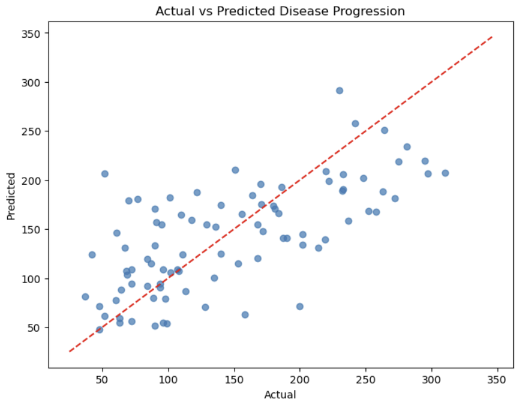

# Linear Regression - 당뇨병 진행도 예측 프로젝트

이 프로젝트는 당뇨병 환자의 임상 데이터를 기반으로 선형 회귀(Linear Regression) 모델을 사용하여  
질병 진행도(disease progression)를 예측하는 분석 실습입니다.

> Predicting diabetes disease progression using linear regression (with feature interpretation).

# 데이터셋 소개

- 출처: `sklearn.datasets.load_diabetes()`
- 입력 피처: 총 10개 (예: age, bmi, bp, s1~s6)
- 타겟 변수: 1년 뒤의 질병 진행도 수치 (연속형)

# 모델링 방식

- 데이터 분할: Train/Test (8:2)
- 스케일링: `StandardScaler`
- 회귀 모델: `LinearRegression`
- 평가 지표:
  - R² Score (설명력)
  - MSE (Mean Squared Error)
- 피처 해석: 회귀 계수 시각화

# 시각화 결과

🔹 실제 vs 예측 값 비교

# 주요 인사이트

- `bmi`, `bp`, `s5`는 질병 진행도에 **상대적으로 높은 영향**
- 회귀 계수를 통해 각 변수의 영향력 해석 가능
- 단순 회귀 모델로도 **R² ≈ 0.5** 수준 확보

# 사용 기술 스택

- Python, Pandas, Matplotlib, Seaborn
- Scikit-learn
- Jupyter Notebook

# 향후 발전 방향 (To-do)

- 다항 회귀 (Polynomial Regression)
- 정규화 기법 적용 (Ridge, Lasso)
- SVR, RandomForest 등 타 모델 비교
- 잔차 분석 및 이상치 탐지

# 폴더 구조

linear_regression_diabetes/
├── notebook/
│ └── diabetes_classification.ipynb
├── images/
│ └── actual_vs_pred.png
├── README.md
